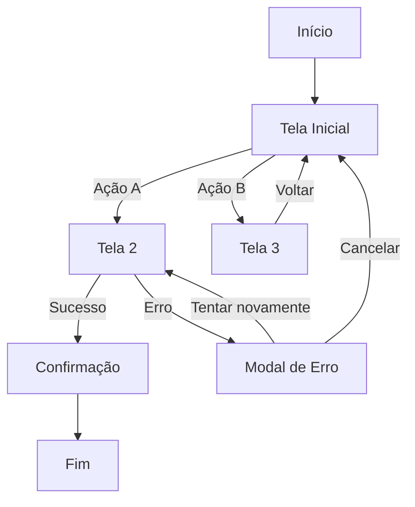

# Fluxo UX Completo — Mapeador de Experiência Total

Sistema completo para documentar TODOS os estados, transições e fluxos alternativos de uma aplicação, não apenas o caminho feliz.

## Visão Geral

Esta skill transforma uma ideia de feature em documentação completa de UX que inclui:
- **Árvore de decisão completa** - todos os caminhos possíveis
- **Storyboard visual** - cada tela/estado quadro a quadro
- **Fluxograma Mermaid** - diagrama técnico navegável
- **Prompts prontos** - para gerar designs em IAs (Stitch, v0, etc.)
- **Documento markdown** - especificação técnica para programadores

**CRITICAL:** Esta skill NÃO cria apenas as "telas principais". Ela força a exploração de TODOS os estados: vazios, erros, loading, cancelamentos, fluxos alternativos, popups em diferentes contextos.

## Processo em 4 Fases

### Fase 1: Descoberta e Exploração

**Objetivo:** Entender a feature e explorar possibilidades até ter clareza total.

#### 1.1 Entrevista Inicial

Fazer perguntas direcionadas:

```
CONTEXTO ESTRATÉGICO
- Qual o objetivo de negócio desta feature?
- Existe planejamento estratégico prévio? (PRD, SPEC, brief)
- Quem é o público-alvo e qual o contexto de uso?

ESCOPO FUNCIONAL
- Quais as funcionalidades CORE (mínimo viável)?
- Quais as funcionalidades DESEJÁVEIS (se der tempo)?
- O que está FORA do escopo desta versão?

TELAS BASE (HAPPY PATH)
- Quais as 3-5 telas principais do fluxo feliz?
- Como o usuário entra neste fluxo?
- Como o usuário sai/completa este fluxo?

INTEGRAÇÕES E DEPENDÊNCIAS
- Depende de autenticação? Login social?
- Consome APIs externas? (pagamento, mapas, etc.)
- Precisa de permissões do sistema? (câmera, localização, etc.)
```

#### 1.2 Mapeamento de Estados Críticos

Para CADA tela base identificada, explorar:

| Estado | Pergunta de Descoberta |
|--------|------------------------|
| **Empty State** | O que aparece quando não há dados ainda? |
| **Loading State** | O que mostra enquanto carrega? Skeleton? Spinner? |
| **Error State** | O que acontece se API falhar? Sem internet? Timeout? |
| **Success State** | Como confirma sucesso? Toast? Modal? Nova tela? |
| **Partial State** | E se carregar só metade dos dados? Mostra parcial ou nada? |
| **Permission Denied** | O que acontece se usuário negar câmera/localização? |

#### 1.3 Mapeamento de Fluxos Alternativos

Para CADA interação (botão, link, formulário), explorar:

```
ÁRVORE DE POSSIBILIDADES

[Botão/Ação X]
  ├─ Usuário clica "Sim"
  │   ├─ Ação sucede → [Próxima tela]
  │   └─ Ação falha → [Tela de erro]
  │
  ├─ Usuário clica "Não"
  │   └─ [Volta para onde? Fecha modal? Cancela tudo?]
  │
  ├─ Usuário clica "Cancelar"
  │   └─ [Perde progresso? Avisa? Salva rascunho?]
  │
  └─ Usuário não faz nada (timeout)
      └─ [Fecha sozinho? Fica esperando? Avisa?]
```

**CRITICAL:** Nunca assumir comportamento. Sempre perguntar explicitamente ao usuário o que deve acontecer em cada bifurcação.

#### 1.4 Validação Contra Planejamento Estratégico

Se existe PRD/SPEC/planejamento prévio:

1. Ler o documento estratégico completo
2. Extrair objetivos de negócio e KPIs
3. Para cada tela mapeada, perguntar:
   - "Esta tela ajuda a atingir [objetivo X]?"
   - "Esta interação pode atrapalhar [KPI Y]?"
4. Identificar gaps:
   - Telas que faltam para atingir objetivos
   - Telas que foram mapeadas mas não têm função estratégica
5. Propor ajustes e validar com o usuário

**Critério de conclusão da Fase 1:** Ter pelo menos 80% das perguntas acima respondidas e validação explícita do usuário: "Ok, podemos avançar para documentação".

---

### Fase 2: Estruturação e Documentação

**Objetivo:** Criar os 3 artefatos principais (Markdown, Mermaid, Prompts).

#### 2.1 Documento Markdown Técnico

Estrutura obrigatória:

```markdown
# [Nome da Feature] - Especificação Completa de UX

## 1. Visão Geral
- **Objetivo:** [1 frase]
- **Público-alvo:** [quem usa]
- **Entrada no fluxo:** [como usuário chega aqui]
- **Saída do fluxo:** [como usuário completa/sai]

## 2. Mapa de Telas (Árvore de Decisão)

[Tela Inicial]
  ├─ Ação A → [Tela 2]
  ├─ Ação B → [Tela 3]
  └─ Voltar → [Tela Anterior]

[Continuar para todas as telas...]

## 3. Storyboard Detalhado

### Tela 1: [Nome da Tela]

**Contexto:** [Quando aparece]

**Elementos visuais:**
- Header: [descrição]
- Conteúdo principal: [descrição]
- Footer/Ações: [botões, links]

**Estados:**
| Estado | Comportamento | Visual |
|--------|---------------|--------|
| Loading | Mostra skeleton de 3 cards | [Descrição visual] |
| Empty | Mensagem "Nenhum item ainda" + botão CTA | [Descrição visual] |
| Erro | Toast vermelho no topo | [Descrição visual] |
| Sucesso | Lista de N items + scroll infinito | [Descrição visual] |

**Interações:**
- [Botão X]: Se clicado → [vai para onde / abre o quê]
- [Link Y]: Se clicado → [ação]
- [Gesto Z]: Se swipe left → [ação]

**Transições:**
- Entrada: [Slide from right / Fade in / etc]
- Saída: [Slide to left / Fade out / etc]

[Repetir para cada tela...]

## 4. Casos Extremos e Validações

### Validações de Formulário
[Listar todos os campos e suas regras]

### Tratamento de Erros
[Mapear cada erro possível e como é apresentado]

### Fluxos de Fallback
[O que acontece quando algo falha]

## 5. Glossário de Componentes
[Lista de todos os componentes únicos: modais, toasts, cards, etc.]
```

#### 2.2 Fluxograma Mermaid

Gerar diagrama técnico usando a sintaxe Mermaid:



**CRITICAL:** Incluir TODOS os estados mapeados, não apenas happy path.

#### 2.3 Prompts Prontos para IAs de Design

Gerar prompts otimizados para cada ferramenta:

**Template para Stitch:**

```
Crie o design completo de [Nome da Feature] com as seguintes telas e estados:

TELA 1: [Nome]
- Contexto: [descrição]
- Elementos: [lista]
- Estados alternativos: [lista]
- Comportamentos: [lista]

TELA 2: [Nome]
[...]

Estilo visual: [moderno/minimalista/etc]
Paleta de cores: [primária, secundária, etc]
Tipografia: [fonte, tamanhos]
Componentes reutilizáveis: [lista]
```

**Template para v0.dev:**

```
Create a complete user flow for [feature name]:

Screens:
1. [Screen 1 name] - [description]
2. [Screen 2 name] - [description]

States for each screen:
- Loading: [behavior]
- Empty: [behavior]
- Error: [behavior]
- Success: [behavior]

Interactions:
- [Button X] → [action]
- [Link Y] → [action]

Use [framework] with [styling approach]
```

**Template para Figma AI:**

```
Design system for [feature name]

Screens: [list]
Components needed: [list]
States per screen: [list]
Color palette: [colors]
Typography scale: [sizes]
Spacing system: [values]
```

**Critério de conclusão da Fase 2:** Ter os 3 arquivos prontos (Markdown completo, Mermaid validado, Prompts testáveis).

---

### Fase 3: Geração de Artefatos Visuais

**Objetivo:** Criar visualizações que facilitem apresentação e validação.

#### 3.1 Criar Storyboard HTML Navegável (Opcional)

Se o usuário quiser uma versão interativa para apresentar:

```html
<!DOCTYPE html>
<html>
<head>
  <title>[Feature Name] - UX Storyboard</title>
  <style>
    /* Estilo minimalista para apresentação */
    body { font-family: system-ui; max-width: 1200px; margin: 0 auto; padding: 20px; }
    .screen { border: 1px solid #ccc; padding: 20px; margin: 20px 0; border-radius: 8px; }
    .state { background: #f5f5f5; padding: 10px; margin: 10px 0; border-left: 4px solid #007bff; }
    .interaction { color: #007bff; font-weight: bold; }
  </style>
</head>
<body>
  <h1>[Feature Name] - Fluxo Completo</h1>

  <div class="screen">
    <h2>Tela 1: [Nome]</h2>
    <p><strong>Contexto:</strong> [descrição]</p>

    <div class="state">
      <h3>Estado: Loading</h3>
      <p>[Descrição visual]</p>
    </div>

    <div class="state">
      <h3>Estado: Sucesso</h3>
      <p>[Descrição visual]</p>
    </div>

    <h3>Interações:</h3>
    <ul>
      <li class="interaction">[Botão X] → [ação]</li>
    </ul>
  </div>

  <!-- Repetir para cada tela -->
</body>
</html>
```

#### 3.2 Exportar para PDF (Opcional)

Se solicitado, usar ferramenta de conversão HTML→PDF para criar documento portável.

---

### Fase 4: Validação e Entrega

**Objetivo:** Garantir que nada foi esquecido e entregar artefatos prontos.

#### 4.1 Checklist de Validação

Executar o script `scripts/validate_flow.py` ou fazer validação manual:

```
COMPLETUDE
□ Todas as telas do happy path estão documentadas?
□ Todos os estados alternativos foram mapeados?
□ Todos os modais/popups têm comportamento definido?
□ Todos os botões têm ação clara?
□ Casos de erro têm tratamento definido?

CONSISTÊNCIA
□ Nomenclatura de telas é consistente?
□ Estados usam mesma terminologia?
□ Fluxograma Mermaid bate com documento Markdown?

ESTRATÉGIA (se houver planejamento prévio)
□ Objetivos de negócio estão refletidos no fluxo?
□ KPIs podem ser medidos com telas atuais?
□ Nenhuma tela é inútil ou redundante?

EXECUTABILIDADE
□ Prompts para IAs estão claros o suficiente?
□ Especificação técnica tem detalhes para programar?
□ Há ambiguidades que precisam ser resolvidas?
```

#### 4.2 Entrega Final

Organizar arquivos em estrutura pronta para uso:

```
[nome-da-feature]-ux-completo/
├── README.md                    # Índice dos artefatos
├── especificacao-tecnica.md     # Documento Markdown completo
├── fluxograma.mermaid           # Diagrama Mermaid
├── prompts/
│   ├── stitch-prompt.txt
│   ├── v0-prompt.txt
│   └── figma-prompt.txt
└── storyboard.html              # (opcional) Versão navegável
```

Apresentar ao usuário:

```
✅ Fluxo UX completo mapeado!

Artefatos criados:
1. Especificação técnica completa: [caminho]
2. Fluxograma Mermaid: [caminho]
3. Prompts prontos para IAs: [caminho]

Próximos passos sugeridos:
- Validar especificação com stakeholders
- Usar prompts para gerar designs no Stitch
- Passar especificação técnica para agentes programadores
```

---

## Recursos Incluídos

### Scripts Disponíveis

| Script | Função |
|--------|--------|
| `scripts/validate_flow.py` | Valida completude da especificação |
| `scripts/generate_mermaid.py` | Gera Mermaid a partir de estrutura JSON |
| `scripts/export_pdf.py` | Converte storyboard HTML em PDF |

### Referências Disponíveis

| Arquivo | Conteúdo |
|---------|----------|
| `references/tipos-estados.md` | Checklist completo de estados possíveis |
| `references/padroes-ui.md` | Padrões comuns de UI (modais, toasts, etc.) |
| `references/validacoes-comuns.md` | Validações típicas de formulários |

### Templates Disponíveis

| Template | Uso |
|----------|-----|
| `assets/templates/spec-template.md` | Template base do documento técnico |
| `assets/templates/storyboard-template.html` | Template HTML navegável |
| `assets/templates/prompt-stitch.txt` | Template de prompt para Stitch |

---

## Antipadrões — O Que Evitar

| Antipadrão | Por Que é Ruim | O Que Fazer |
|------------|----------------|-------------|
| Mapear apenas happy path | 80% dos bugs vêm de estados não mapeados | Sempre explorar empty, error, loading |
| Assumir comportamentos óbvios | "Óbvio" varia entre pessoas | Perguntar explicitamente cada interação |
| Documentar sem validar estratégia | Telas bonitas que não servem o negócio | Bater contra PRD/objetivos sempre |
| Gerar prompts genéricos | IAs precisam de contexto específico | Incluir paleta, estilo, comportamentos |
| Esquecer micro-interações | UX ruim vem dos detalhes | Mapear animações, transições, feedback |

---

## Exemplo Completo: Feature de Login

Ver `references/exemplo-login-completo.md` para um exemplo real de aplicação desta skill em uma feature de autenticação com:
- Login tradicional
- Login social (Google, Apple)
- Recuperação de senha
- Primeiro acesso
- Todos os estados de erro, loading, sucesso
