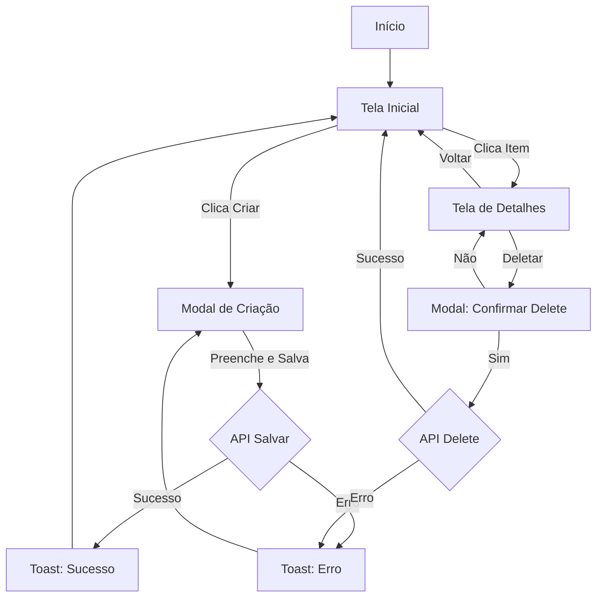

# [Nome da Feature] - Especificação Completa de UX

> **Versão:** 1.0
> **Data:** [Data]
> **Autor:** [Nome]
> **Status:** [Draft / In Review / Approved]

---

## 1. Visão Geral

### 1.1 Objetivo
[Descrever em 1-2 frases o que esta feature resolve]

### 1.2 Público-alvo
[Quem usa esta feature]

### 1.3 Entrada no Fluxo
[Como o usuário chega nesta feature - link direto? menu? onboarding?]

### 1.4 Saída do Fluxo
[Como o usuário completa ou sai desta feature]

### 1.5 Alinhamento Estratégico
[Como esta feature atende objetivos de negócio / KPIs]

---

## 2. Mapa de Telas (Árvore de Decisão)

```
[Tela Inicial: Nome]
  ├─ [Ação A] → [Tela 2]
  │   ├─ [Sucesso] → [Tela 3]
  │   └─ [Erro] → [Modal de Erro]
  │
  ├─ [Ação B] → [Tela 4]
  │   ├─ [Confirma] → [Tela 5]
  │   └─ [Cancela] → [Tela Inicial]
  │
  └─ [Voltar] → [Tela Anterior]

[Continuar mapeando todas as telas...]
```

---

## 3. Storyboard Detalhado

### 3.1 Tela: [Nome da Tela 1]

**Contexto:** [Quando esta tela aparece]

**Elementos Visuais:**

| Seção | Descrição |
|-------|-----------|
| **Header** | [Título, botões de navegação, etc.] |
| **Conteúdo Principal** | [Área central, cards, listas, etc.] |
| **Footer/Ações** | [Botões primários, links secundários] |

**Estados:**

| Estado | Quando Acontece | Comportamento Visual | Interações Disponíveis |
|--------|-----------------|----------------------|------------------------|
| **Loading** | Ao entrar na tela | Skeleton de 3 cards pulsando | Nenhuma (aguarda carregar) |
| **Empty** | Nenhum dado encontrado | Ilustração + mensagem "Nenhum item ainda" + botão CTA | Botão "Criar Primeiro Item" |
| **Error** | API falhou | Toast vermelho no topo com mensagem | Botão "Tentar Novamente" |
| **Success** | Dados carregados | Lista de N items com scroll infinito | Todos os botões/links ativos |
| **Partial** | Alguns items falharam | Mostra items válidos + banner warning no topo | Botão "Recarregar Faltantes" |

**Interações:**

| Elemento | Ação | Resultado |
|----------|------|-----------|
| **Botão "Criar"** | Click/Tap | Abre [Modal de Criação] |
| **Item da Lista** | Click/Tap | Navega para [Tela de Detalhes] |
| **Botão "Filtrar"** | Click/Tap | Abre [Drawer de Filtros] |
| **Swipe Left no Item** | Gesto | Revela botão "Deletar" |
| **Pull to Refresh** | Gesto | Recarrega lista com animação |

**Transições:**

| Tipo | Animação | Duração |
|------|----------|---------|
| **Entrada** | Slide from right | 300ms |
| **Saída** | Slide to left | 300ms |
| **Modal** | Slide up + backdrop fade | 250ms |

**Validações:**
[Se houver campos/formulários, listar regras de validação]

---

### 3.2 Tela: [Nome da Tela 2]

[Repetir estrutura acima para cada tela]

---

## 4. Componentes e Modais

### 4.1 Modal: [Nome do Modal]

**Trigger:** [O que abre este modal]

**Estrutura:**
- **Header:** [Título, botão fechar]
- **Body:** [Conteúdo, campos, etc.]
- **Footer:** [Botões de ação]

**Decisões de Design:**
- **Tamanho:** [Small 400px / Medium 600px / Large 800px]
- **Fecha com ESC:** [Sim/Não]
- **Fecha clicando fora:** [Sim/Não - cuidado com perda de dados]
- **Backdrop blur:** [Sim/Não]

**Ações:**
| Botão | Tipo | Ação |
|-------|------|------|
| [Nome] | Primary | [O que faz] |
| [Nome] | Secondary | [O que faz] |

---

### 4.2 Toast: [Tipo de Toast]

**Quando aparece:** [Contexto]

**Conteúdo:**
- **Mensagem:** "[Texto exato]"
- **Tipo:** [Success / Error / Warning / Info]
- **Duração:** [3s / 5s / Infinito]
- **Posição:** [Top-center / Top-right / Bottom-center]
- **Ação secundária:** [Botão "Desfazer" / "Ver Detalhes" / Nenhuma]

---

## 5. Fluxos Alternativos

### 5.1 Fluxo: Sem Internet

```
[Usuário entra no app sem conexão]
  → Mostra banner fixo no topo: "Sem conexão. Algumas funcionalidades limitadas."
  → Telas com cache mostram dados desatualizados + badge "Offline"
  → Telas sem cache mostram Empty State: "Conecte-se à internet"
  → Botões de ação ficam disabled com tooltip explicando
  → [Conexão restaurada]
    → Banner muda para "Reconectado" (3s) e desaparece
    → Auto-reload das telas abertas
```

---

### 5.2 Fluxo: Sessão Expirada

```
[Usuário inativo por 24h]
  → [Faz qualquer ação]
    → API retorna 401
    → Modal aparece: "Sua sessão expirou. Faça login novamente."
      ├─ Botão "Fazer Login" → Redireciona para tela de login
      └─ Botão "Cancelar" → Fecha modal, fica na tela atual (disabled)
```

---

### 5.3 Fluxo: Erro de Validação

```
[Usuário preenche formulário e clica "Salvar"]
  → Validações do frontend:
    ├─ Email inválido → Borda vermelha no campo + mensagem "Email inválido"
    ├─ Campo obrigatório vazio → Borda vermelha + mensagem "Campo obrigatório"
    └─ Todos válidos → Prossegue para envio
  → [Envia para API]
    ├─ API retorna 400 (validação backend) → Toast vermelho com mensagem do servidor
    ├─ API retorna 500 (erro servidor) → Toast vermelho genérico + opção "Reportar"
    └─ API retorna 200 → Toast verde "Salvo com sucesso" + atualiza tela
```

---

## 6. Casos Extremos e Edge Cases

### 6.1 Permissões Negadas

**Cenário:** Usuário nega permissão de câmera

**Comportamento:**
- Modal explica: "Para usar esta funcionalidade, precisamos acessar sua câmera"
- Botões: "Ir para Configurações" / "Usar Upload de Arquivo"
- Se escolher upload: Abre file picker como fallback

---

### 6.2 Dados Corrompidos

**Cenário:** Item da lista tem dados faltando/inválidos

**Comportamento:**
- Item mostra placeholder nos campos faltantes
- Badge "Dados incompletos"
- Botão "Editar e Corrigir"

---

### 6.3 Limite de Plano Atingido

**Cenário:** Usuário free tenta criar mais que 5 items

**Comportamento:**
- Botão "Criar" fica disabled
- Tooltip: "Limite de 5 items no plano gratuito"
- Banner no topo: "Você atingiu o limite. [Fazer Upgrade]"
- Click em Upgrade → Modal com planos

---

## 7. Glossário de Componentes

| Componente | Descrição | Onde Usa |
|------------|-----------|----------|
| **Card de Item** | Card com imagem, título, descrição, botões | Tela de Listagem |
| **Modal de Confirmação** | Modal sim/não para ações destrutivas | Deletar Item |
| **Toast de Sucesso** | Feedback verde de ação concluída | Após salvar, deletar, etc. |
| **Skeleton Loader** | Placeholder animado durante loading | Tela de Listagem (loading) |
| **Empty State Illustration** | SVG + texto quando não há dados | Tela vazia inicial |

---

## 8. Anexos

### 8.1 Fluxograma Mermaid



### 8.2 Referências
[Links para PRD, SPEC, Figma, etc.]

### 8.3 Changelog
| Versão | Data | Mudanças |
|--------|------|----------|
| 1.0 | [Data] | Versão inicial |
